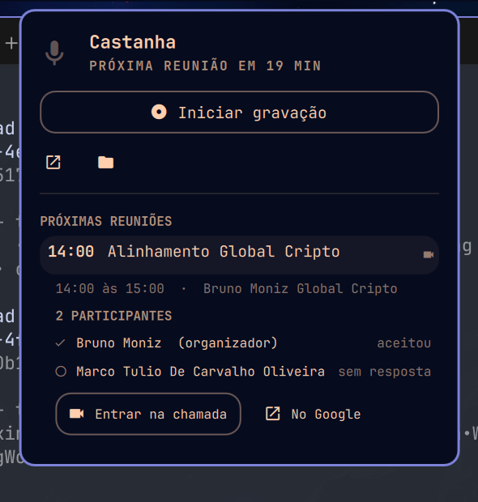

# Castanha 🌰

Assistente executivo e gravador inteligente de reuniões para Linux e Omarchy.

Substituto aberto e nativo do Granola: grava chamadas sem bot, separa áudio em dois canais via PipeWire, sincroniza com o Google Calendar, notifica antes da reunião e transforma transcrições brutas em notas estruturadas (Bronze, Silver e Gold), prontas para o **Zinom** e para sua **LLM Wiki**.

<p align="center">
  
</p>

---

## 🚀 Principais Recursos

1. **Captura Bot-Free via PipeWire**:
   - Grava silenciosamente chamadas no Google Meet, Teams, Zoom e WhatsApp Web/Desktop.
   - **Modo Duplo**: Canal esquerdo (microfone do usuário) e canal direito (áudio dos participantes remotos).
   - **Modo Presencial**: Grava apenas o microfone do computador para reuniões presenciais.
2. **Integração com Google Calendar**:
   - Sincronização direta via feed privado iCal ou integração com o hub Zinom.
   - Todos os eventos da agenda principal, inclusive os de dia inteiro e os sem link de chamada;
     o que não for reunião você esconde no painel (a série inteira, de uma vez).
   - Popup interativo 2 minutos antes com botão para entrar na chamada e botão para gravar.
   - Captura automática dos participantes (nomes e e-mails), pauta e links.
3. **Esteira Bronze -> Silver -> Gold**:
   - **Bronze**: Áudio original compactado em Opus + `metadata.json` + `transcript_raw.txt`.
   - **Silver**: Notas de reunião estruturadas em Markdown (YAML frontmatter, Resumo Executivo, Discussões, Decisões Tomadas e Ações).
   - **Gold**: Fatos atômicos estruturados prontos para ingestão no Zinom (`remember` e `brain_fact`).
   - O áudio nunca sai do Bronze: se a transcrição falhar (sem internet, Groq fora do ar), o painel
     mostra "tentar de novo" e `castanha retry` reprocessa. Reunião longa vai em fatias para a Groq.
4. **Plugin Nativo do Omarchy (Quickshell)**:
   - Widget discreto na barra com status ao vivo (`● REC 00:14:20`).
   - Painel popout com controle de gravação, próxima reunião e acesso rápido às notas.
   - Atalho global de teclado no Hyprland (`Super+Alt+R`).
5. **Backend Flexível**:
   - Roda 100% local ou envia o processamento pesado para uma VPS remota.

---

## 📦 Instalação

### Via Omarchy Plugin Marketplace (Recomendado)

```bash
omarchy plugin add https://github.com/BrunooMoniz/castanha --enable
~/.config/omarchy/plugins/io.github.brunoomoniz.castanha/setup
```

### Instalação Manual

```bash
git clone https://github.com/BrunooMoniz/castanha.git ~/.local/share/castanha
cd ~/.local/share/castanha && ./install.sh
```

Para adicionar o atalho global no Hyprland (`~/.config/hypr/hyprland.conf`):
```ini
bind = $mainMod ALT, R, exec, castanha toggle
```

---

## 🗑️ Remoção

Para desinstalar o plugin e o comando da máquina:
```bash
rm -f ~/.local/bin/castanha
omarchy plugin remove io.github.brunoomoniz.castanha
```

---

## 📋 Requisitos de Sistema

- **Omarchy** com omarchy-shell / Quickshell
- **PipeWire** com módulo pulse (`pactl`)
- **FFmpeg** e **ffprobe**
- **Python** 3.10 ou superior

---

## 🛠️ Uso via CLI

```bash
# Iniciar gravação de reunião
castanha start
castanha start --mic-only          # Modo presencial (somente microfone)
castanha start --title "Alinhamento com Time"

# Alternar gravação (inicia se ocioso, finaliza se gravando)
castanha toggle

# Pausar e retomar
castanha pause
castanha resume

# Finalizar e processar notas
castanha stop

# Consultar status
castanha status
castanha status --json

# Iniciar o daemon de calendário e notificações
castanha daemon --background

# Listar e abrir notas
castanha notes
castanha notes --open

# Segunda chance: transcrever de novo uma gravação que ficou sem notas
# (sem internet na hora do stop, Groq fora do ar, VPS lenta)
castanha retry                     # a última pendente
castanha retry <slug>              # uma reunião específica
castanha retry --all               # todas as pendentes

# Reenviar ao Zinom uma reunião já transcrita
castanha sync [slug]
```

---

## ⚙️ Configuração

O arquivo de configuração vive em `~/.config/castanha/config.json`:

```json
{
  "storage": {
    "base_dir": "~/Notes/Meetings"
  },
  "calendar": {
    "feeds": [
      {
        "name": "Meu Calendário",
        "url": "https://calendar.google.com/calendar/ical/seu-email/private-xxx/basic.ics"
      }
    ]
  },
  "transcription": {
    "provider": "groq",
    "groq_api_key": "sua-chave-groq"
  },
  "llm": {
    "provider": "groq",
    "api_key": "sua-chave-groq",
    "model": "openai/gpt-oss-120b"
  },
  "zinom": {
    "enabled": true,
    "endpoint": "https://zinom.ai/mcp",
    "token": "seu-bearer-token"
  }
}
```
