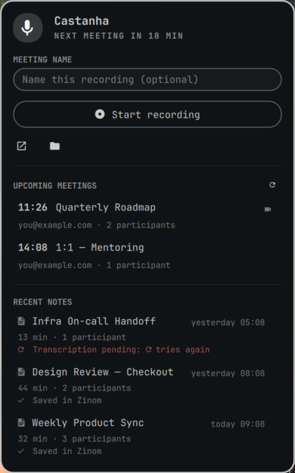
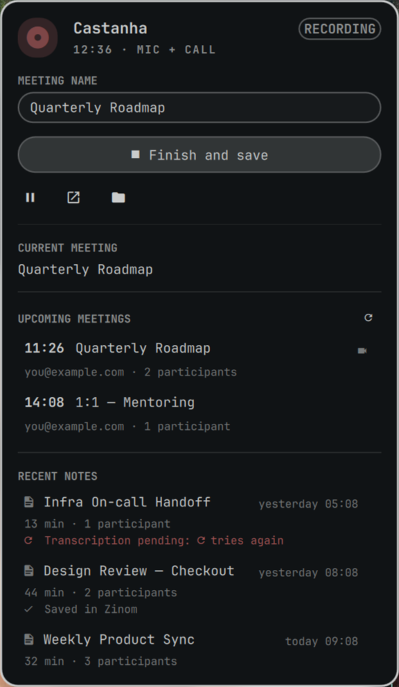

[English](README.md) | Português (Brasil)

# Castanha 🌰

**Grave suas reuniões no Linux sem convidar um bot.** O Castanha fica na barra
do Omarchy, captura os dois lados da chamada direto do PipeWire e transforma a
gravação em notas estruturadas que você lê, busca e guarda.

Ninguém na reunião vê um aviso de "Castanha entrou na chamada", porque nada
entra na chamada — o áudio é capturado na sua própria máquina.

<p align="center">
  
  &nbsp;&nbsp;
  
</p>

<p align="center">
  <em>Parado, com a agenda e as notas recentes (esquerda) e gravando, com o
  cronômetro (direita). Todos os dados exibidos são simulados.</em>
</p>

---

## Comece aqui: sua primeira gravação em 3 minutos

### 1. Instale

```bash
omarchy plugin add https://github.com/BrunooMoniz/castanha --enable
~/.config/omarchy/plugins/io.github.brunoomoniz.castanha/setup
```

O passo do `setup` é o que disponibiliza o comando `castanha` e cria seu
arquivo de configuração. Ele nunca sobrescreve uma configuração existente.

### 2. Coloque o ícone na barra

```bash
omarchy bar put io.github.brunoomoniz.castanha
```

Um ícone de microfone aparece na barra. É toda a interface.

### 3. Grave alguma coisa

Clique no ícone e aperte **Iniciar gravação** — ou crie um atalho:

```ini
# ~/.config/hypr/hyprland.conf
bind = $mainMod ALT, R, exec, castanha toggle
```

Fale por um minuto e aperte **Encerrar e salvar**. Quando terminar, você tem:

```
~/Notes/Meetings/
├── bronze/2026-02-17_0900_sync-de-produto/   # áudio + transcrição bruta
├── silver/2026-02-17_0900_sync-de-produto.md # a nota legível
└── gold/2026-02-17_0900_sync-de-produto.json # fatos extraídos
```

Abra a nota com `castanha notes --open`. Pronto — você já está usando.

> **Funciona de imediato?** Gravar, o cronômetro, a lista de notas e o
> diagnóstico de áudio não precisam de nada além de FFmpeg e PipeWire.
> **Transcrição e resumo precisam de um provedor** — veja
> [Transformando fala em notas](#transformando-fala-em-notas). Até você
> configurar um, o Castanha mantém o áudio salvo no Bronze e diz que a
> transcrição está pendente, em vez de fingir que deu certo.

---

## O que você ganha de verdade

**Os dois lados da conversa, separados.** O Castanha grava seu microfone num
canal e o áudio dos outros participantes no outro, então a transcrição sabe
distinguir você de todo mundo. Funciona com Google Meet, Teams, Zoom e WhatsApp
— qualquer coisa que toque áudio pelo PipeWire. Para reunião presencial,
`castanha start --mic-only` grava só a sala.

**Notas, não um muro de texto.** A transcrição bruta é só o primeiro estágio:

| Estágio | O que é | Onde fica |
|---|---|---|
| **Bronze** | A evidência: áudio Opus, `metadata.json`, transcrição bruta | `bronze/<slug>/` |
| **Silver** | A nota que um humano lê: resumo, decisões, ações | `silver/<slug>.md` |
| **Gold** | Fatos atômicos, cada um citando o trecho literal de onde veio | `gold/<slug>.json` |

Um fato Gold sem trecho literal que o sustente é **descartado**, não chutado —
então nada nos fatos extraídos é invenção.

**Nada se perde quando algo quebra.** O áudio chega ao Bronze antes de qualquer
tentativa de transcrição. Se a conexão cair ou o provedor estiver fora, o painel
mostra *"Transcrição pendente — tenta de novo"* e o áudio espera. O
`castanha retry` retoma exatamente o que faltou; nunca apaga e nunca recomeça
do zero.

**Ele avisa quando o áudio saiu ruim.** Se o microfone ficou mudo a chamada
inteira, a nota diz isso, em vez de te deixar com um arquivo silencioso e
nenhuma explicação.

**Sua agenda, se você quiser.** Aponte o Castanha para um feed iCal privado (ou
para o hub do Zinom) e o painel lista o que vem, com um botão para entrar na
chamada e outro para gravar. Dois minutos antes, você recebe um popup.
Totalmente opcional — o Castanha funciona bem como gravador manual.

---

## Requisitos

| | |
|---|---|
| **Omarchy** | com omarchy-shell / Quickshell |
| **PipeWire** | com o módulo pulse (`pactl`) |
| **FFmpeg** | e o `ffprobe` |
| **Python** | 3.10 ou superior |

Os quatro já vêm numa instalação padrão do Omarchy. O `setup` avisa o que
estiver faltando, em vez de falhar no meio do caminho.

---

## Transformando fala em notas

O Castanha não embute serviço de transcrição. Você escolhe um, e a escolha é
explícita — ele nunca vai mandar suas reuniões em silêncio para um lugar que
você não configurou.

Edite o `~/.config/castanha/config.json`:

```json
{
  "transcription": {
    "provider": "groq",
    "groq_api_key": "sua-chave-groq"
  },
  "llm": {
    "provider": "groq",
    "api_key": "sua-chave-groq",
    "model": "openai/gpt-oss-120b"
  }
}
```

Essa é a configuração mais simples que funciona: a [Groq](https://console.groq.com)
transcreve com Whisper e escreve o resumo. Uma chave gratuita já basta para
começar; reuniões longas vão em fatias, então uma chamada de 2 horas termina.

**Prefere que nada saia da sua máquina?** Use `"provider": "vps_ssh"` e aponte
`vps_ssh_host` para um servidor seu — o Castanha roda o Whisper lá por SSH,
retomando jobs duráveis em vez de reenviar tudo. `deepgram` também é suportado.

**Só testando?** `CASTANHA_MOCK_TRANSCRIBER=1` gera uma transcrição falsa para
você ver o fluxo inteiro. É opt-in de propósito e nunca se mistura às notas
reais.

Seu arquivo de configuração guarda chaves de API, então o Castanha o cria como
arquivo `0600` (só do dono) dentro de um diretório `0700`, escreve de forma
atômica e recusa lê-lo através de um symlink.

<details>
<summary><strong>Referência completa de configuração</strong></summary>

```json
{
  "storage": {
    "base_dir": "~/Notes/Meetings"
  },
  "audio": {
    "default_mode": "dual",
    "bitrate": "64k",
    "sample_rate": 48000,
    "format": "ogg"
  },
  "calendar": {
    "enabled": true,
    "notify_minutes_before": 2,
    "auto_record": false,
    "feeds": [
      {
        "name": "Minha Agenda",
        "url": "https://calendar.google.com/calendar/ical/.../basic.ics"
      }
    ]
  },
  "transcription": {
    "provider": "groq",
    "groq_api_key": "sua-chave-groq",
    "language": "auto"
  },
  "llm": {
    "provider": "groq",
    "api_key": "sua-chave-groq",
    "model": "openai/gpt-oss-120b"
  },
  "zinom": {
    "enabled": false,
    "endpoint": "https://zinom.ai/mcp",
    "token": ""
  }
}
```

- `storage.base_dir` — onde Bronze/Silver/Gold moram.
- `audio.default_mode` — `dual` (mic + áudio da chamada) ou `mic_only` (presencial).
- `transcription.language` — `auto` detecta PT/EN/misto; ou fixe `"pt"`, `"en"`.
- `calendar.auto_record` — começa a gravar sozinho quando a reunião inicia.
- `zinom` — sincronização opcional com o hub [Zinom](https://zinom.ai), desligada por padrão.

A transcrição remota continua rodando na VPS sem manter a conexão SSH aberta; o
`castanha sync --all` recolhe os resultados prontos e retoma os checkpoints.
Quem escreveu cada resumo fica registrado em `summary_provider` nos metadados
da reunião.

</details>

---

## Comandos do dia a dia

Você nunca precisa do terminal — o painel cobre o caminho comum — mas a CLI é o
conjunto completo de recursos.

```bash
castanha toggle              # inicia se parado, encerra se gravando (use no atalho)
castanha start --mic-only    # reunião presencial
castanha start --title "Sync do Time"
castanha pause / resume
castanha stop                # encerra e monta as notas

castanha notes               # lista as reuniões
castanha notes --open        # abre a nota mais recente
castanha notes <slug>        # tudo sobre uma reunião

castanha status              # o que está acontecendo agora (tem --json)
castanha retry               # segunda chance para uma transcrição pendente
castanha retry --all
castanha sync --all          # retoma jobs e entregas pendentes
```

<details>
<summary><strong>Agenda, renomear, limpeza e o daemon</strong></summary>

```bash
# Agenda
castanha agenda                    # próximas reuniões
castanha agenda refresh            # consulta as agendas agora
castanha agenda hide <uid>         # para de mostrar um evento (série inteira)
castanha agenda unhide <uid>       # volta a mostrar (--all restaura tudo)
castanha agenda hidden             # o que você pediu para esconder
castanha start --event <uid>       # grava com título e participantes do evento

# O daemon de notificações (necessário para popups de agenda e auto-record)
castanha daemon --background
castanha daemon --status
castanha daemon --stop

# Renomear: o nome da pasta é identidade e nunca muda, só o título
castanha rename current "Nome Melhor"   # durante a gravação
castanha rename last "Nome Melhor"
castanha rename <slug> "Nome Melhor"

# Limpeza — o que se apaga vai para base_dir/.trash/, nunca rm -rf
castanha delete-recording <slug>   # libera espaço, mantém as notas
castanha delete-meeting <slug>     # remove a reunião (recuperável)
castanha recordings list <slug>
castanha recordings delete <slug> [arquivo]

# Anexa outra gravação a uma reunião existente
castanha start --meeting <slug>
```

</details>

---

## Desinstalando

```bash
rm -f ~/.local/bin/castanha
omarchy plugin remove io.github.brunoomoniz.castanha
```

Suas reuniões em `~/Notes/Meetings` e sua configuração em `~/.config/castanha`
**ficam intactas** — remover o plugin nunca apaga suas gravações. Apague esses
dois diretórios você mesmo, se quiser.

---

## Privacidade e consentimento

O Castanha grava áudio na sua máquina. **Gravar uma conversa sem avisar os
outros participantes é ilegal em muitos lugares** — a exigência de consentimento
de uma ou de todas as partes varia por país e por estado. O Castanha não se
anuncia na chamada, então avisar as pessoas é responsabilidade sua, e você deve
avisar.

O que sai do seu computador, e só se você configurar: o áudio vai para o
provedor de transcrição que você definir, e a transcrição vai para o provedor de
LLM que você definir. Com `vps_ssh`, é uma máquina sua. Sem provedor
configurado, nada é enviado a lugar algum. A sincronização com o Zinom vem
desligada.

As capturas de tela deste README foram geradas com dados simulados pelo
`scripts/gerar-capturas.py`, que monta um `HOME` descartável com reuniões
inventadas — nenhuma reunião real jamais apareceu nelas.

---

## Resolvendo problemas

**O ícone não está na barra.** `omarchy bar put io.github.brunoomoniz.castanha`
e depois `omarchy-shell shell rescanPlugins`. Mudança em QML exige
`omarchy-restart-shell`.

**`castanha: command not found`.** O passo do `setup` foi pulado, ou o
`~/.local/bin` não está no seu `PATH`.

**A gravação saiu em silêncio.** Veja `castanha notes <slug>` — o Castanha
diagnostica o áudio e diz se o microfone estava mudo no sistema ou no teclado.

**As notas nunca aparecem.** O `castanha status` mostra o estado atual e o
`castanha retry` tenta de novo uma transcrição pendente. Seu áudio já está
salvo em `bronze/<slug>/`.

---

## Desenvolvimento

```bash
git clone https://github.com/BrunooMoniz/castanha.git
cd castanha && ./install.sh          # linka o plugin no Omarchy

python3 -m unittest discover tests   # ⚠️ inicia uma gravação REAL
python3 -m unittest tests.test_storage tests.test_cli tests.test_plugin_layout
python3 scripts/gerar-capturas.py    # regenera as capturas do README
```

A suíte completa exercita o caminho de captura ao vivo e deixa uma reunião real
em `~/Notes/Meetings`; prefira os módulos específicos enquanto itera. Os testes
de painel exigem um compositor Wayland.

Arquitetura e notas de projeto estão em [`docs/`](docs/). Relatos de bug e pull
requests são bem-vindos.

---

## Licença

[MIT](LICENSE) — Bruno Moniz.

**Dependências externas:** FFmpeg/ffprobe (LGPL/GPL), PipeWire via `pactl`
(MIT), biblioteca padrão do Python 3 (PSF), Quickshell/Qt em tempo de execução
(LGPL). Serviços de terceiros opcionais, usados só quando você configura: Groq,
Deepgram, Zinom. O Castanha não embute nenhum deles e não distribui credenciais.
